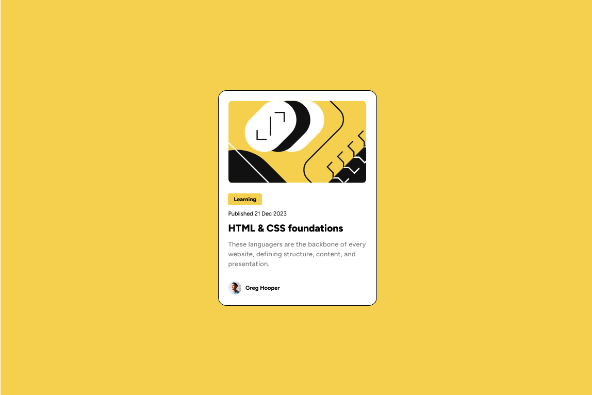

# Frontend Mentor - Blog preview card solution

This is a solution to the [Blog preview card challenge on Frontend Mentor](https://www.frontendmentor.io/challenges/blog-preview-card-ckPaj01IcS). Frontend Mentor challenges help you improve your coding skills by building realistic projects.

## Table of contents

- [Overview](#overview)
- [The challenge](#the-challenge)
- [Screenshot](#screenshot)
- [Links](#links)
- [My process](#my-process)
- [Built with](#built-with)
- [What I learned](#what-i-learned)
- [Continued development](#continued-development)
- [Useful resources](#useful-resources)
- [Author](#author)
- [Acknowledgments](#acknowledgments)

## Overview

### The challenge

Users should be able to:

- See hover and focus states for all interactive elements on the page

### Screenshot

### Links

- Solution URL: [Solution URL](https://github.com/juancmdev/blog-preview-card-main)
- Live Site URL: [Live site URL](https://blog-preview-card-main-juancmdev.netlify.app/)

## My process

### Built with

- Semantic HTML5 markup
- CSS custom properties
- Flexbox
- Mobile-first workflow

### What I learned

I have learned so much with this projyect, I have reinforced a lot of knowledge and I am happy for this.

### Continued development

I want to focus learning any framework like React or Vue JS

### Useful resources

## Author

- Frontend Mentor - [@juancmdev](https://www.frontendmentor.io/profile/juancmdev)
- Github - [@juancmdev](https://github.com/juancmdev)
  -Linkedin - [@juan-carlos-moreno-j](www.linkedin.com/in/juan-carlos-moreno-j-14829423b)
